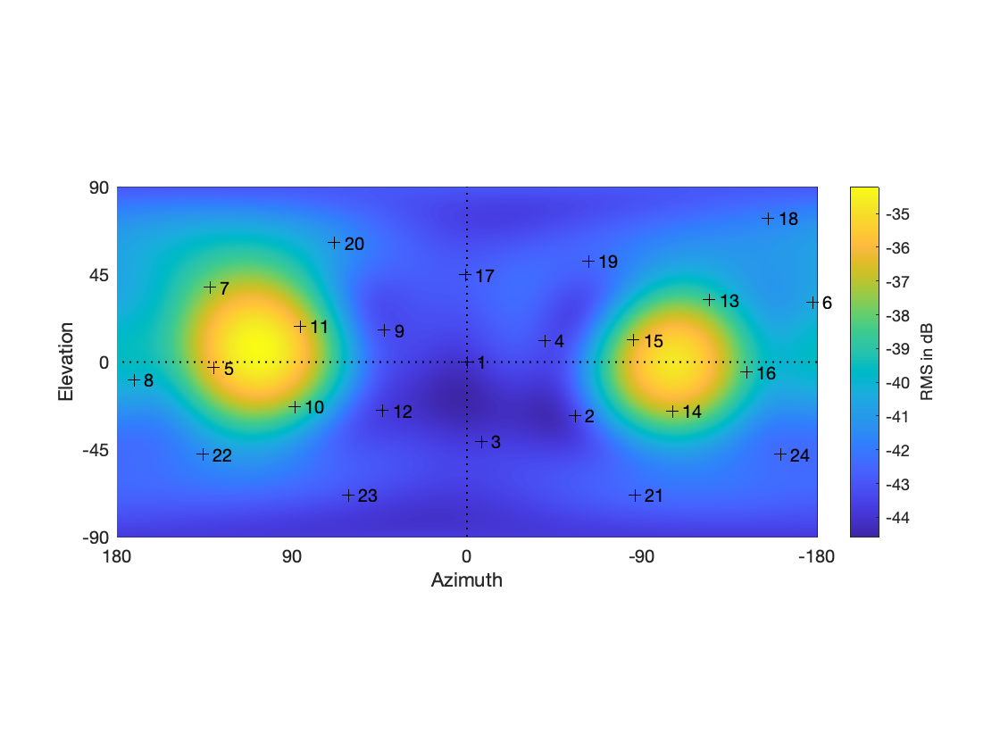
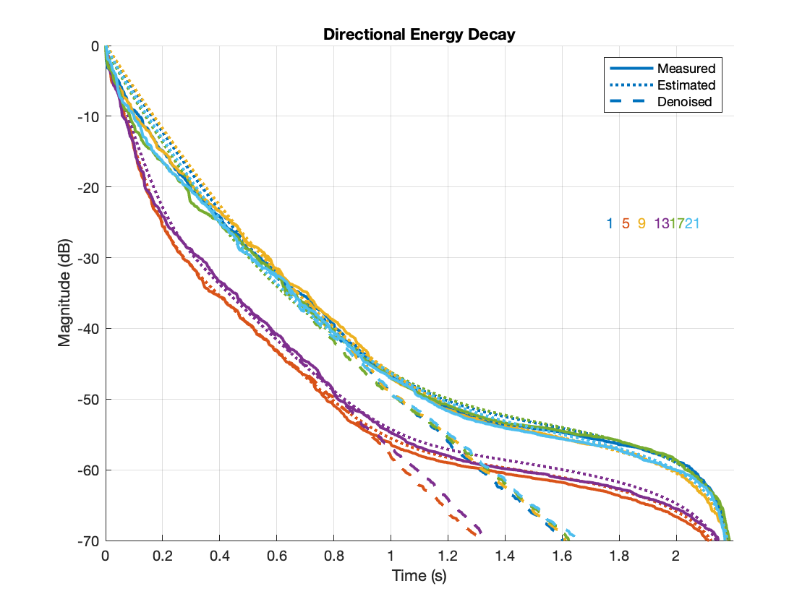
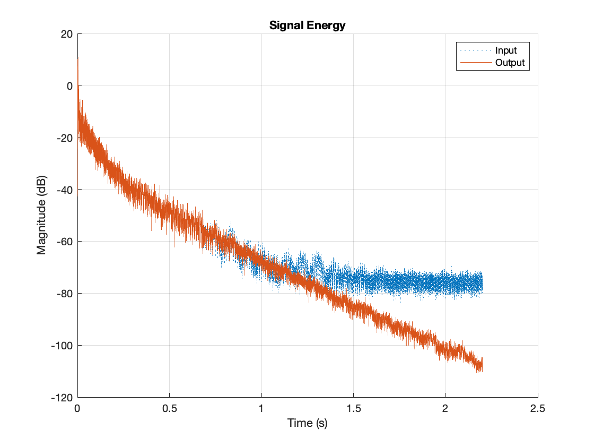

# Directional Multi-slope SRIR De-Noising

Reverberation de-noising for spherical harmonic (SH) spatial / directional room 
impulse responses (SRIRs / DRIRs).

The proposed method utilizes a directional (multi-slope) parameterization of the 
reverberation tail and replaces parts that are estimated to be dominated by 
noise.

More information can be found in the publication
<http://dx.doi.org/10.17743/jaes.2022.0017>

Quickstart by having a look at the *DEMO_** script.

First, clone and checkout the git repository and its submodule
`git submodule update --init --recursive`
After this, the submodule 'DecayFitNet' should be at commit '33a5a546'.

Please make sure to meet the dependencies/requirements of the submodule
[DecayFitNet](https://github.com/georg-goetz/DecayFitNet).

---
From this room impulse response with directional energy:

To this directional EDC estimation and restoration (i.e. denoising):

Resulting in a denoised output:

